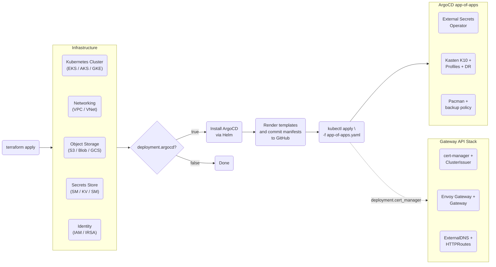
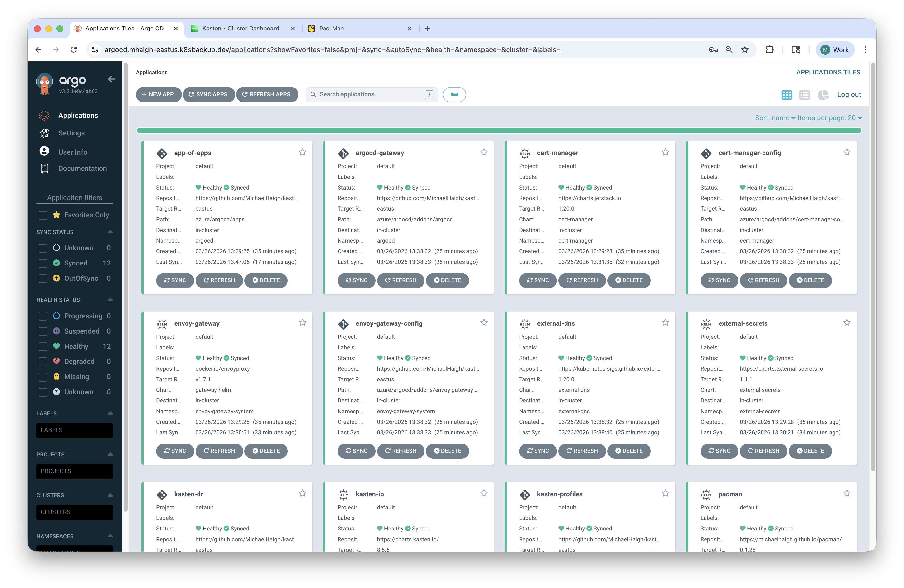
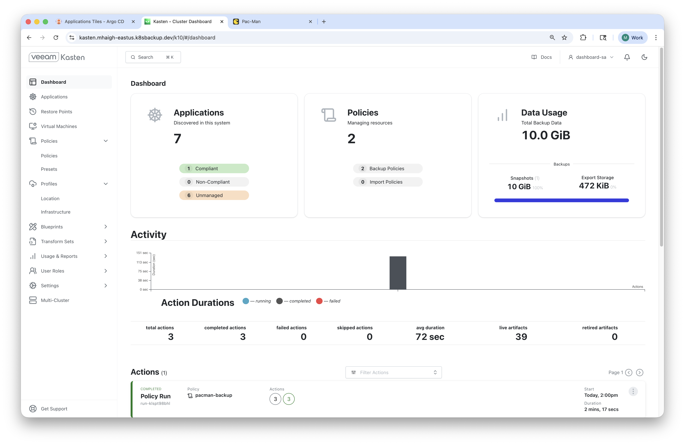
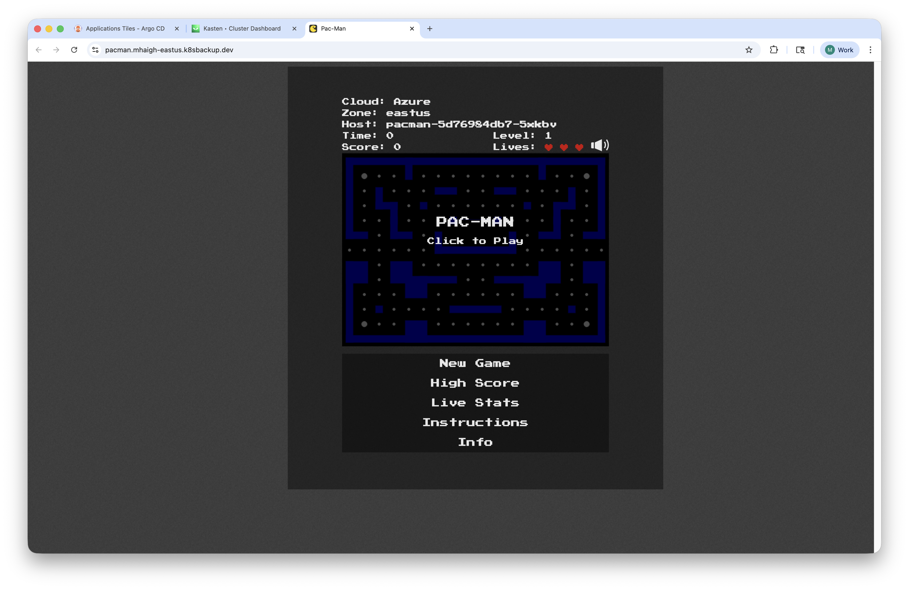

# GitOps for Kasten: Infrastructure and Data Protection as Code

This repository contains Terraform code which creates hyperscaler Kubernetes-as-a-Service offerings:

* [Amazon Elastic Kubernetes Service (EKS)](./aws/k8s-tf)
* [Azure Kubernetes Service (AKS)](./azure/k8s-tf)
* [Google Kubernetes Engine (GKE)](./gcp/k8s-tf)

In addition to deploying Kubernetes, the Terraform IaC will optionally install ArgoCD, which is then used to bootstrap the cluster by:

* Dynamically generating ArgoCD application and addon specification YAML, which are automatically committed to the repository with the [Terraform GitHub Provider](https://registry.terraform.io/providers/integrations/github/latest/docs) (adhering to the GitOps principle of git being the single source of truth)
* ArgoCD then deploys the following applications via the [app-of-apps](https://argo-cd.readthedocs.io/en/latest/operator-manual/cluster-bootstrapping/#app-of-apps-pattern) pattern:
  * [External Secrets Operator](https://external-secrets.io/latest/) to securely generate Kubernetes secrets on the deployed cluster
  * [Kasten K10](https://github.com/kastenhq/k10/tree/master/helm/k10) with infrastructure and location profiles to store Kubernetes application backups, and disaster recovery configured for Azure and AWS
  * [Pacman](https://github.com/MichaelHaigh/pacman) demo application with a Kasten policy for protection
  * (optional) [cert-manager](https://cert-manager.io/) with Cloudflare DNS-01 validation for TLS certificates
  * (optional) [Envoy Gateway](https://gateway.envoyproxy.io/) with [Kubernetes Gateway API](https://gateway-api.sigs.k8s.io/) for HTTPS routing
  * (optional) [ExternalDNS](https://kubernetes-sigs.github.io/external-dns/) for automatic Cloudflare DNS record management

## Architecture



## Screenshots

| ArgoCD | Kasten K10 | Pacman |
|---|---|---|
|  |  |  |

## Prerequisites

The following tools must be installed locally:

* [Terraform](https://developer.hashicorp.com/terraform/install)
* [kubectl](https://kubernetes.io/docs/tasks/tools/)
* A cloud provider CLI: [aws](https://docs.aws.amazon.com/cli/latest/userguide/getting-started-install.html), [az](https://learn.microsoft.com/en-us/cli/azure/install-azure-cli), or [gcloud](https://cloud.google.com/sdk/docs/install)

## Getting Started

This repository *must* be forked, as `git push` privileges are required for automated Terraform commits. Then change into the `k8s-tf` directory of the hyperscaler of your choice, and initialize terraform:

```text
terraform init
```

The provider version in each `main.tf` file is constrained by the `~>` operator to ensure code compatibility, however feel free to change to a different operator if needed. Information on required privileges for the various providers can be found in the specific hyperscaler directory readme.

Next, update the `default.tfvars` file to have the deployment parameters of your choosing. Additional information on their meanings can be found in the `variables.tf` file.

Plan your deployment with the following command (more information on [workspaces](#workspaces-support) in the section below):

```text
terraform plan -var-file="$(terraform workspace show).tfvars"
```

Create your deployment:

```text
terraform apply -var-file="$(terraform workspace show).tfvars" && git pull
```

The `git pull` is required because Terraform commits generated ArgoCD manifests to the remote branch via the GitHub provider, so `git pull` syncs those commits locally.

If `deployment.argocd` is set to `true`, configure kubeconfig using the command from the `_1_` output variable, then deploy the ArgoCD app-of-apps manifest to kick off GitOps syncing:

```text
kubectl apply -f ../argocd/app-of-apps.yaml
```

When your deployment is no longer needed, run the following command to clean up all resources:

```text
terraform destroy -var-file="$(terraform workspace show).tfvars" && git pull
```

## Workspaces Support

All code in this repository has been designed to support [Terraform Workspaces](https://developer.hashicorp.com/terraform/cli/workspaces). This enables multiple deployments (for example: `prod` and `dr`, and/or `useast1` and `useast2`) of the same type of environments. To create new workspaces (beyond the `default` workspace), run the following commands:

```text
terraform workspace new <workspace-name>
git checkout -b $(terraform workspace show)
git push -u origin $(terraform workspace show)
```

> **Note**: your workspace name and git branch name *must* be identical, as ArgoCD's `targetRevision` is derived from the workspace name.

Next, copy the `default.tfvars` file:

```text
cp default.tfvars $(terraform workspace show).tfvars
```

Optionally edit the `<workspace-name>.tfvars` file, and then deploy the new environment with the same command:

```text
terraform apply -var-file="$(terraform workspace show).tfvars" && git pull
```

Note that `*.tfvars` files are gitignored by default (except `default.tfvars`). To commit a workspace-specific tfvars file, use `git add -f <workspace>.tfvars`. This is recommended to adhere to GitOps principles, assuming no secrets are contained directly within the file.

To switch to a different workspace, run:

```text
terraform workspace select <workspace-name>
```

To view all available workspaces, run:

```text
terraform workspace list
```

## Terraform State

Terraform state is stored locally. If you need to collaborate or share state across machines, consider configuring a [remote backend](https://developer.hashicorp.com/terraform/language/backend).
